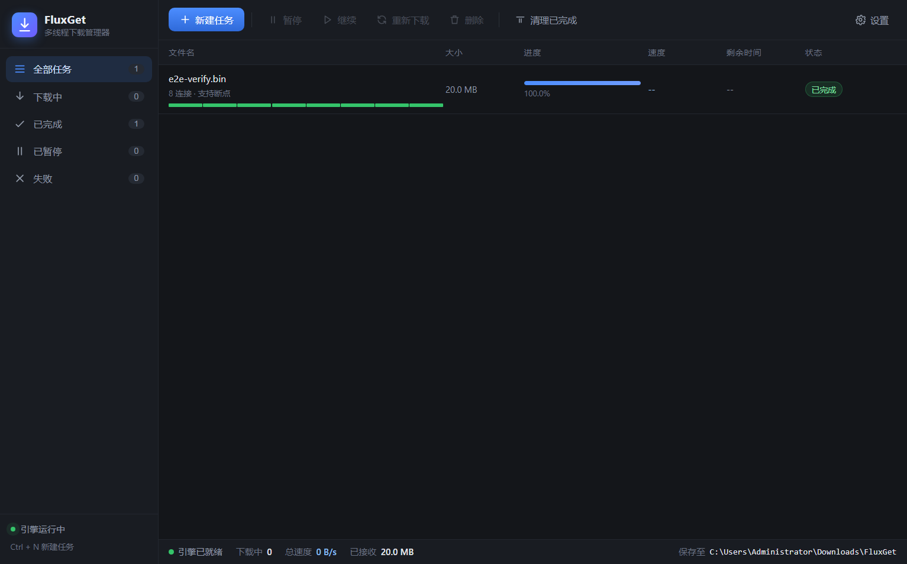

# FluxGet 下载管理器

商业级多线程下载管理器，对标 IDM 的核心下载能力，基于 Electron + React + TypeScript 构建，下载引擎完全自研（零第三方下载库依赖），无 GPL 传染风险，可安全用于商业闭源产品。



## 核心能力

- **多线程分片下载**：单任务最多 32 连接并发拉取，速度远超单线程
- **动态分片抢占**：空闲连接自动分裂大分片，慢连接被其他连接抢占剩余区间（IDM 同款策略）
- **字节级断点续传**：分片进度实时落盘，崩溃 / 断网 / 重启后从精确偏移继续，已下载数据不重传
- **智能降级**：服务端不支持 Range 时自动退化为单连接流式下载
- **双层令牌桶限速**：全局与单任务独立限速，实测偏差 < 5%
- **失败重试**：指数退避 + 断点续接，最多可配重试次数
- **HTTP(S) 代理**：支持 CONNECT 隧道穿透（含 TLS）与明文正向代理
- **浏览器接管**（Chrome / Edge）：接管浏览器下载、右键菜单下载、网页视频嗅探与悬浮下载按钮
- **剪贴板监视**：复制下载链接自动弹出新建任务（可开关）
- **资源预览**：新建任务时自动解析文件名、大小、是否支持断点
- **专业 UI**：分片可视化、实时速度、剩余时间、分类管理、右键菜单、系统通知

## 浏览器集成（IDM 同款能力）

FluxGet 内置本地通信桥接服务 + Chrome MV3 扩展，提供三类能力：

1. **接管浏览器下载**：点击网页下载链接时自动转交 FluxGet 多线程下载（本机未运行时自动回落给浏览器）
2. **网页媒体嗅探**：自动发现页面中的视频 / 音频直链，工具栏弹窗勾选批量下载；视频右上角出现「FluxGet 下载」悬浮按钮
3. **右键菜单**：任意链接 / 视频 / 音频 / 图片一键使用 FluxGet 下载

**安装扩展**：打开 FluxGet → 设置 → 浏览器支持，按页面引导操作：在浏览器打开 `chrome://extensions`（Edge 为 `edge://extensions`）→ 开启「开发者模式」→ 「加载已解压的扩展程序」选择安装目录下的 `extension` 文件夹。

**安全设计**：桥接服务仅监听 127.0.0.1，请求必须携带 `chrome-extension://` Origin 且通过 token 校验，普通网页无法伪造请求下发任务（10 项自动化用例验证，见 `npm run test:bridge`）。

## 安装与运行

### Windows（本机已打包，位于 `release/1.2.0/`）

| 方式 | 文件 | 说明 |
|------|------|------|
| **便携版** | `FluxGet-Portable-1.2.0-x64.exe` | 单文件，双击即用，不写入注册表，适合 U 盘随身携带 |
| **安装版** | `FluxGet-Setup-1.2.0-x64.exe` | 标准安装向导，可自选安装路径，自动创建桌面与开始菜单快捷方式 |

> **首次运行提示**：程序尚未做代码签名，Windows SmartScreen 会弹「Windows 已保护你的电脑」。点击「更多信息」→「仍要运行」即可，这是自签程序的正常提示，不影响使用。正式发布前购买代码签名证书即可消除该提示。

### macOS

按芯片类型选择对应安装包，**不要选错**：

| 芯片 | 文件 | 判断方法 |
|------|------|----------|
| **Apple 芯片**（M1/M2/M3/M4） | `FluxGet-1.2.0-arm64.dmg` | 左上角苹果图标 →「关于本机」→ 芯片显示 Apple M* |
| **Intel 芯片** | `FluxGet-1.2.0-x64.dmg` | 「关于本机」→ 处理器显示 Intel |

打开 dmg 后把 FluxGet 拖入 Applications 即可。免安装压缩包 `FluxGet-1.2.0-{x64,arm64}.zip` 解压后可直接运行。

> **首次运行提示**：未签名应用在 macOS 上会被 Gatekeeper 拦截，需「右键 → 打开」一次。详见 `docs/RELEASE.md` 的签名与公证章节。

> macOS 安装包由 GitHub Actions 在 macOS 环境构建（Windows 上无法跨平台打 macOS 包），详见 `docs/RELEASE.md`。

从源码运行（开发模式）：

```bash
npm install     # 安装依赖
npm start       # 构建并启动桌面客户端
```

## 运行测试

```bash
npm run test:engine   # 引擎自测（11 项：分片完整性 / 断点续传 / 限速精度 / 落盘恢复等）
npm run test:bridge   # 浏览器桥接自测（10 项：Origin 拦截 / token 鉴权 / 端到端落盘等）
node .tmp/net-smoke.mjs   # 真实外网下载冒烟测试（需网络）
```

测试覆盖 SHA256 级数据完整性校验，断点续传验证「续传仅拉取缺失字节」（实测比值 1.000，零重复传输）。

## 打包发布

```bash
npm run dist          # Windows：NSIS 安装包 + 便携版（约各 80MB）
npm run dist:dir      # 仅产出免安装目录 win-unpacked
npm run dist:mac      # macOS：x64 + arm64 的 dmg 与 zip（需 macOS 环境）
npm run dist:mac:x64  # 仅 Intel
npm run dist:mac:arm64# 仅 Apple 芯片
npm run dist:all      # 全平台（需 macOS 环境）
npm run release:check # 发布前自检：版本一致性 + 产物齐全性
```

产物输出至 `release/<版本号>/`，版本号取自 package.json。**每个版本必须同时提供 Windows 与 macOS（x64 + arm64）产物**，流程见 `docs/RELEASE.md`。

## 多设备开发（Windows + Mac）

代码以 GitHub 仓库为唯一交换中心：**Windows 版在这台机器上开发与打包，macOS 版在 Mac 上开发与其打包**。

Mac 上首次搭建：

```bash
git clone https://github.com/wxinhappy/FluxGet.git && cd FluxGet
npm install
npm start
```

开工 `git pull`，收工前 `npm run typecheck` → `git add -A` → `git commit` → `git push`。一次只在一台机器上改，换机器前先把改动推上去。

完整命令对照表与冲突处理见 `docs/DEV-SETUP.md`。

## 技术架构

```
src/
├── main/                    # 主进程
│   ├── engine/              # 下载引擎（纯 Node，可独立测试）
│   │   ├── DownloadEngine   # 调度中枢：队列、并发、广播、持久化
│   │   ├── DownloadTask     # 单任务执行体：分片、动态分裂、重试、限速
│   │   ├── HttpClient       # HTTP(S) 传输层：重定向、代理隧道、TLS
│   │   ├── ChunkedFileWriter# 预分配 + 定向写入，多连接并行落盘
│   │   ├── SpeedLimiter     # 令牌桶限速器
│   │   └── ResourceProbe    # Range 试探、文件名解析、大小探测
│   ├── bridge/              # 浏览器集成
│   │   ├── HttpBridge       # 本地通信服务（Origin 白名单 + token 鉴权）
│   │   └── ClipboardWatcher # 剪贴板下载链接监视
│   ├── store/               # 配置与断点持久化（原子写入）
│   ├── ipc.ts               # IPC 处理器注册
│   └── index.ts             # 应用生命周期
├── preload/index.ts         # contextBridge 受控 API
extension/                   # Chrome / Edge MV3 扩展（随安装包分发）
├── renderer/                # React 界面
└── shared/                  # 三方共享类型与调参常量
```

**关键设计**

| 决策 | 说明 |
|------|------|
| 自研引擎而非 aria2 | aria2 为 GPLv2，商业闭源有传染风险；自研 TS 引擎零依赖、可控可审计 |
| 预分配 + 定向写入 | 文件按目标大小预分配，各连接并行写各自区间，无合并步骤 |
| JSON 原子持久化 | 断点 1.5s 节流落盘，写临时文件再 rename，强杀不损数据 |
| 引擎与 Electron 解耦 | engine/ 不 import electron，纯 Node 可测（scripts/ 下的测试即证明） |

## 配置项

下载目录、并发连接数（1-32）、最大并行任务数、全局/单任务限速、连接超时、重试次数、User-Agent、TLS 证书校验策略、代理服务器（HTTP/HTTPS/SOCKS5）均可在应用内「设置」中调整，持久化于 `%APPDATA%/fluxget/settings.json`。

## 后续路线

- [x] 浏览器扩展（Chrome/Edge 接管下载 + 视频嗅探）
- [x] macOS 版本（Intel / Apple 芯片分别构建，与 Windows 同步发布）
- [ ] BT / 磁力链接（DHT + Tracker + Peer 协议）
- [ ] 批量导入 / 定时下载 / 队列规则
- [ ] 多语言、安装包自动更新
